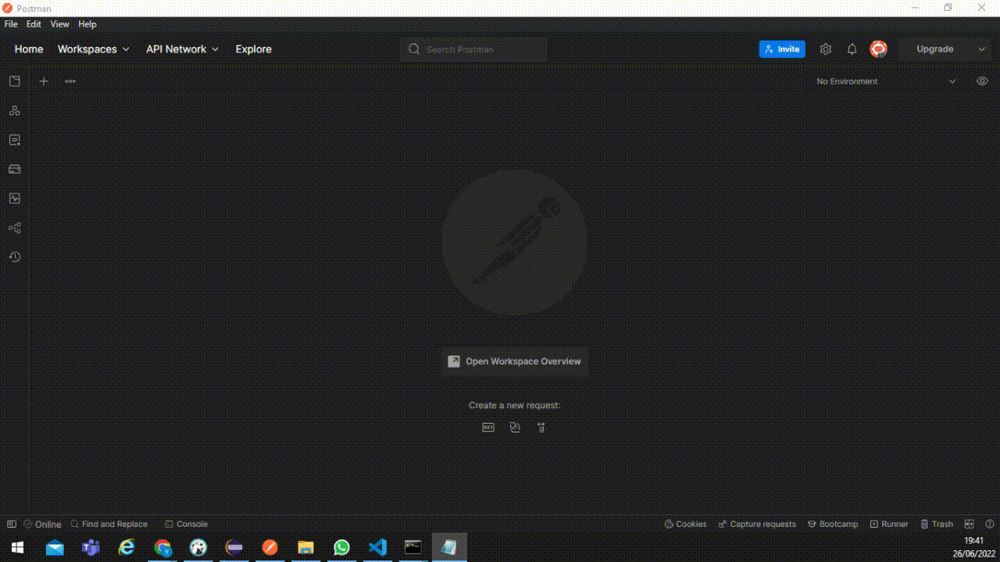

# TODO

TODO é uma API para criação de uma lista de tarefas criada para o Desafio Back End do portallacrei.com.br.


## Documentação da API

### GET

#### Retorna todos os itens

* Requisição

```http
  GET /todo/
```

* Resposta
~~~json
[
  {
      "id": 1,
      "titulo": "Criar uma API com Django",
      "descricao": "Criar uma API responsável por adicionar e exibir uma lista de tarefas.",
      "prioridade": 9
  },
  {
      "id": 2,
      "titulo": "Criar uma nova tarefa",
      "descricao": "Adicionar uma tarefa qualquer",
      "prioridade": 4
  }
]
~~~

#### Retorna um item

* Requisição

```http
  GET /todo/${id}
```

| Parâmetro   | Tipo       | Descrição                                   |
| :---------- | :--------- | :------------------------------------------ |
| `id`      | `integer` | **Obrigatório**. O ID da tarefa que você quer |

* Resposta

~~~json
{
"id": 2,
"titulo": "Criar uma nova tarefa",
"descricao": "Adicionar uma tarefa qualquer",
"prioridade": 4
}
~~~

### POST 

* Requisição

```http
  POST /todo/
```

* Body

~~~json
{
  "titulo": "Inserir uma nova tarefa",
  "descricao": "Detalhamento dessa nova tarefa",
  "prioridade": 7
}
~~~

* Resposta

~~~json
{
  "id": 8,
  "titulo": "Inserir uma nova tarefa",
  "descricao": "Detalhamento dessa nova tarefa",
  "prioridade": 7
}
~~~
## Referências

[Criando uma API com Django - Hipsters Ponto Talks #11](https://www.youtube.com/watch?v=BKChTO8GADk)

[Django](https://www.djangoproject.com/)

[Django REST framework](https://www.django-rest-framework.org/)
## Demonstração

